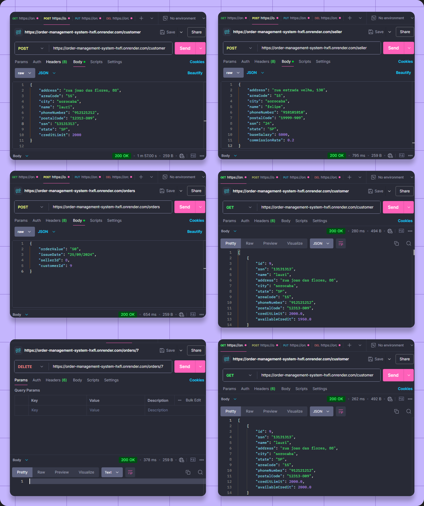
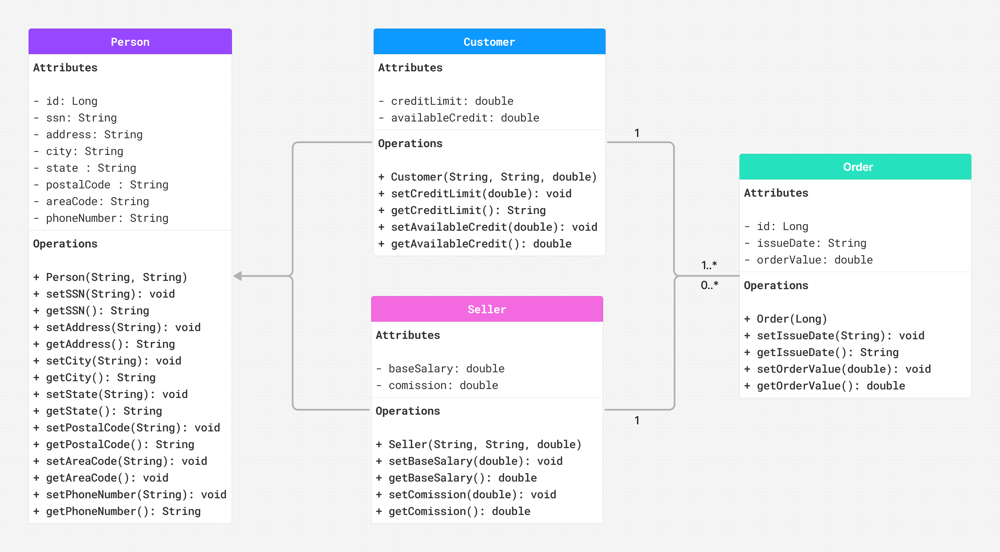

<div align="center">

# Order Management System

</div>


<br>

✨ Give this repository a star!

<br>

Order Management System is a backend application to manage orders in a store. It enables the creation, retrieval, updating, and deletion of customers, sellers and orders. All data is stored and managed using a PostgreSQL database. This system is designed to automate key processes such as tracking customer credit limits and linking orders to the correct customer and seller.

I deployed the application using Render. You can see the testing process with Postman below

<details open>
<summary>
 Screenshots
</summary> <br />
    
<p align="center">
    
</details>

## 💭 Initial Thinking

This project represents my first experience working with Spring Boot and Spring Data JPA. Previously, I used JDBC and plain Java for my applications, but I wanted to explore more modern tools and approaches. I also chose to follow the Controller-Service-Repository design pattern, alongside Entities and DTOs to ensure better separation of concerns and maintainable code.

## 🎠 Features

### 1. Customer Management
- **Register and maintain** customer information.
- **Track** customer credit limits and available credit.
- Automatically **update customer credit limits** based on their orders.
- **Change** the customer's available credit (it can never exceed the credit limit).
- **Increase** the credit limit (the available credit will adjust accordingly).

### 2. Seller Management
- **Create, read, modify, and delete** seller details.
- Link sellers to specific orders.

### 3. Order Processing
- **Create, read, modify, and delete** orders
- Manage customer orders and link them to specific sellers.


## 💻 Technologies Used

- **JDK 21 (Amazon Corretto)**: Java is the primary language for this project.
- **Spring Boot**: Framework to simplify backend development.
  - **Spring Data JPA**: For managing data persistence and database interactions.
- **PostgreSQL**: Relational database for data storage.
- **Maven**: For dependency management and project building.

## 📖 Project Structure

The project follows the **Controller-Service-Repository** architecture pattern, with additional layers for **Entities** and **DTOs** to enhance modularity and maintainability.



## 🔮 What have I learned?

I had an introduction to Docker and made my first deployment using Render. One of my decisions was to not work with thymeleef for ui because I wanted to focus more on backend development, testing everything mainly through Postman. But yes, I plan on expanding the code when I start learning front-end development.

Working with the controller-repository-service pattern was really nice and a new thing to me. I also had to deal with exception handling, something that I had only seen in Exercism's tasks (you can see them [here](https://github.com/LauriESB/exercism-java)) before, so it was also fun to deeply understand. 

Well, it's always great to see how real projects provide such an immersive learning experience.

## 🎮 How to run it on your PC

<details open>
<summary>
 see here
</summary>

## Prerequisites

Before running the application, make sure you have [Docker](https://docs.docker.com/get-docker/) installed on your machine.

> **Note:** There is no need to have JDK or PostgreSQL installed locally. Docker will handle all dependencies within isolated containers.

## Getting Started

### 1. Clone the repository


```bash
git clone https://github.com/your-username/order-management-app.git
```

```bash
cd order-management-system/backend/order-management-system
```

### 2. Build and run the application

To build and start the application using Docker Compose, run the following command:

```bash
docker-compose up --build
```

This command will:

- Build the application image based on the `Dockerfile` in the application.
- Create and start the containers for both the Spring Boot application and the PostgreSQL database.
- Set up the necessary environment variables for the database connection.

### 3. Access the application

You can make the HTTP requests now

```
http://localhost:8080
```

### 4. Stopping the application

```bash
docker-compose down
```

This command will stop and remove the containers, but the database and application data will remain intact unless you explicitly delete the volumes.

### Important Ports

- **Application**: `8080` (Spring Boot Application)
- **Database**: `5432` (PostgreSQL Database)
</details>

<br>

<div align="center">
 
</div>